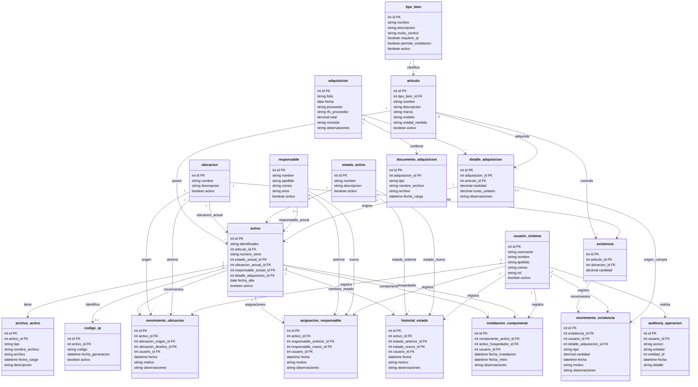

```mermaid
classDiagram
direction TB

    class tipo_bien {
        int id PK
        string nombre
        string descripcion
        string modo_control
        boolean requiere_qr
        boolean permite_instalacion
        boolean activo
    }

    class articulo {
        int id PK
        int tipo_bien_id FK
        string nombre
        string descripcion
        string marca
        string modelo
        string unidad_medida
        boolean activo
    }

    class activo {
        int id PK
        string identificador
        int articulo_id FK
        string numero_serie
        int estado_actual_id FK
        int ubicacion_actual_id FK
        int responsable_actual_id FK
        int detalle_adquisicion_id FK
        date fecha_alta
        boolean activo
    }

    class existencia {
        int id PK
        int articulo_id FK
        int ubicacion_id FK
        decimal cantidad
    }

    class ubicacion {
        int id PK
        string nombre
        string descripcion
        boolean activo
    }

    class responsable {
        int id PK
        string nombre
        string apellido
        string correo
        string area
        boolean activo
    }

    class usuario_sistema {
        int id PK
        string username
        string nombre
        string apellido
        string correo
        string rol
        boolean activo
    }

    class estado_activo {
        int id PK
        string nombre
        string descripcion
        boolean activo
    }

    class adquisicion {
        int id PK
        string folio
        date fecha
        string proveedor
        string rfc_proveedor
        decimal total
        string moneda
        string observaciones
    }

    class detalle_adquisicion {
        int id PK
        int adquisicion_id FK
        int articulo_id FK
        decimal cantidad
        decimal costo_unitario
        string observaciones
    }

    class documento_adquisicion {
        int id PK
        int adquisicion_id FK
        string tipo
        string nombre_archivo
        string archivo
        datetime fecha_carga
    }

    class archivo_activo {
        int id PK
        int activo_id FK
        string tipo
        string nombre_archivo
        string archivo
        datetime fecha_carga
        string descripcion
    }

    class codigo_qr {
        int id PK
        int activo_id FK
        string codigo
        datetime fecha_generacion
        boolean activo
    }

    class movimiento_ubicacion {
        int id PK
        int activo_id FK
        int ubicacion_origen_id FK
        int ubicacion_destino_id FK
        int usuario_id FK
        datetime fecha
        string motivo
        string observaciones
    }

    class asignacion_responsable {
        int id PK
        int activo_id FK
        int responsable_anterior_id FK
        int responsable_nuevo_id FK
        int usuario_id FK
        datetime fecha
        string motivo
        string observaciones
    }

    class historial_estado {
        int id PK
        int activo_id FK
        int estado_anterior_id FK
        int estado_nuevo_id FK
        int usuario_id FK
        datetime fecha
        string motivo
        string observaciones
    }

    class instalacion_componente {
        int id PK
        int componente_activo_id FK
        int activo_hospedador_id FK
        int usuario_id FK
        datetime fecha_instalacion
        datetime fecha_retiro
        string observaciones
    }

    class movimiento_existencia {
        int id PK
        int existencia_id FK
        int usuario_id FK
        int detalle_adquisicion_id FK
        string tipo
        decimal cantidad
        datetime fecha
        string motivo
        string observaciones
    }

    class auditoria_operacion {
        int id PK
        int usuario_id FK
        string accion
        string entidad
        int entidad_id
        datetime fecha
        string detalle
    }


    %% CLASIFICACION DE BIENES
    tipo_bien "1" --> "*" articulo : clasifica

    %% ARTICULOS INDIVIDUALES Y POR CANTIDAD
    articulo "1" --> "*" activo : posee
    articulo "1" --> "*" existencia : controla

    %% SITUACION ACTUAL DEL ACTIVO
    ubicacion "1" --> "*" activo : ubicacion_actual
    estado_activo "1" --> "*" activo : estado_actual
    responsable "0..1" --> "*" activo : responsable_actual

    %% EXISTENCIAS
    ubicacion "1" --> "*" existencia : almacena

    %% ADQUISICIONES
    adquisicion "1" --> "*" detalle_adquisicion : contiene
    articulo "1" --> "*" detalle_adquisicion : adquirido
    detalle_adquisicion "1" --> "*" activo : origina

    %% DOCUMENTOS
    adquisicion "1" --> "*" documento_adquisicion : contiene
    activo "1" --> "*" archivo_activo : tiene

    %% CODIGO QR
    activo "1" --> "0..1" codigo_qr : identifica

    %% HISTORIAL DE UBICACIONES
    activo "1" --> "*" movimiento_ubicacion : movimientos
    ubicacion "1" --> "*" movimiento_ubicacion : origen
    ubicacion "1" --> "*" movimiento_ubicacion : destino
    usuario_sistema "1" --> "*" movimiento_ubicacion : registra

    %% HISTORIAL DE RESPONSABLES
    activo "1" --> "*" asignacion_responsable : asignaciones
    responsable "1" --> "*" asignacion_responsable : anterior
    responsable "1" --> "*" asignacion_responsable : nuevo
    usuario_sistema "1" --> "*" asignacion_responsable : registra

    %% HISTORIAL DE ESTADOS
    activo "1" --> "*" historial_estado : cambios_estado
    estado_activo "1" --> "*" historial_estado : estado_anterior
    estado_activo "1" --> "*" historial_estado : estado_nuevo
    usuario_sistema "1" --> "*" historial_estado : registra

    %% COMPONENTES
    activo "1" --> "*" instalacion_componente : componente
    activo "1" --> "*" instalacion_componente : hospedador
    usuario_sistema "1" --> "*" instalacion_componente : registra

    %% MOVIMIENTOS DE INVENTARIO POR CANTIDAD
    existencia "1" --> "*" movimiento_existencia : movimientos
    usuario_sistema "1" --> "*" movimiento_existencia : registra
    detalle_adquisicion "0..1" --> "*" movimiento_existencia : origen_compra

    %% AUDITORIA
    usuario_sistema "1" --> "*" auditoria_operacion : realiza
```