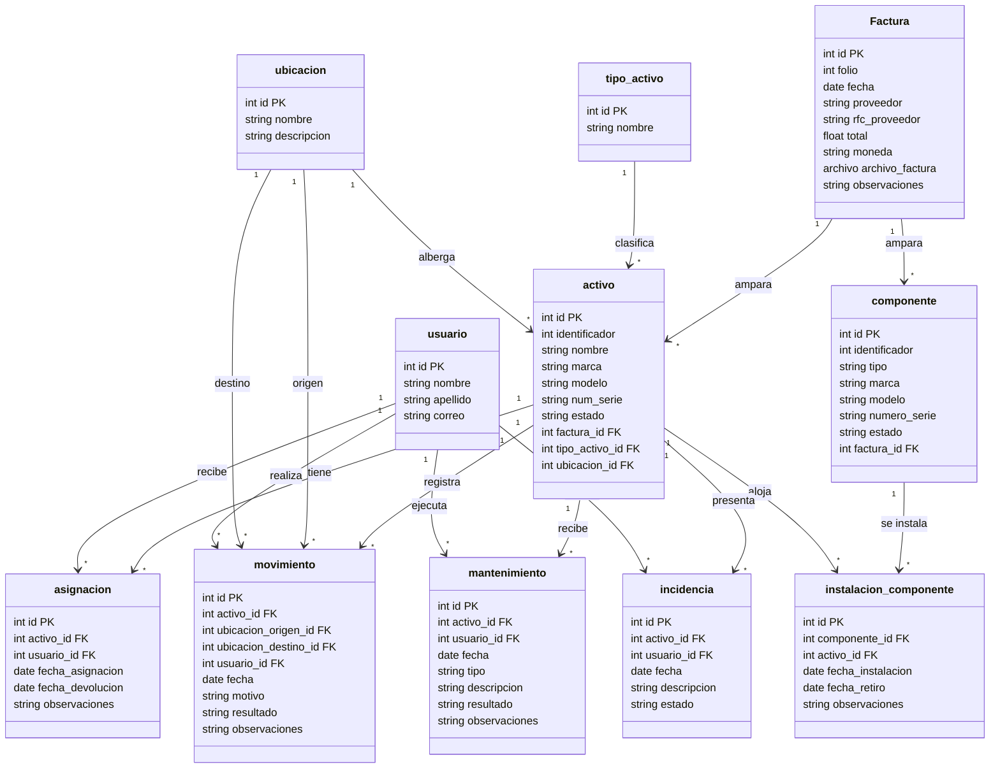

```mermaid
classDiagram
direction TB

    class Factura {
        int id PK
        int folio
        date fecha
        string proveedor
        string rfc_proveedor
        float total
        string moneda
        archivo archivo_factura
        string observaciones
    }

    class tipo_activo {
        int id PK
        string nombre
    }

    class ubicacion {
        int id PK
        string nombre
        string descripcion
    }

    class usuario {
        int id PK
        string nombre
        string apellido
        string correo
    }

    class activo {
        int id PK
        int identificador
        string nombre
        string marca
        string modelo
        string num_serie
        string estado
        int factura_id FK
        int tipo_activo_id FK
        int ubicacion_id FK
    }

    class componente {
        int id PK
        int identificador
        string tipo
        string marca
        string modelo
        string numero_serie
        string estado
        int factura_id FK
    }

    class asignacion {
        int id PK
        int activo_id FK
        int usuario_id FK
        date fecha_asignacion
        date fecha_devolucion
        string observaciones
    }

    class movimiento {
        int id PK
        int activo_id FK
        int ubicacion_origen_id FK
        int ubicacion_destino_id FK
        int usuario_id FK
        date fecha
        string motivo
        string resultado
        string observaciones
    }

    class instalacion_componente {
        int id PK
        int componente_id FK
        int activo_id FK
        date fecha_instalacion
        date fecha_retiro
        string observaciones
    }

    class mantenimiento {
        int id PK
        int activo_id FK
        int usuario_id FK
        date fecha
        string tipo
        string descripcion
        string resultado
        string observaciones
    }

    class incidencia {
        int id PK
        int activo_id FK
        int usuario_id FK
        date fecha
        string descripcion
        string estado
    }

    %% Activo
    Factura "1" --> "*" activo : ampara
    tipo_activo "1" --> "*" activo : clasifica
    ubicacion "1" --> "*" activo : alberga

    %% Componente
    Factura "1" --> "*" componente : ampara

    %% Asignación
    activo "1" --> "*" asignacion : tiene
    usuario "1" --> "*" asignacion : recibe

    %% Movimiento
    activo "1" --> "*" movimiento : registra
    ubicacion "1" --> "*" movimiento : origen
    ubicacion "1" --> "*" movimiento : destino
    usuario "1" --> "*" movimiento : realiza

    %% Instalación de componente
    componente "1" --> "*" instalacion_componente : se instala
    activo "1" --> "*" instalacion_componente : aloja

    %% Mantenimiento
    activo "1" --> "*" mantenimiento : recibe
    usuario "1" --> "*" mantenimiento : ejecuta

    %% Incidencia
    activo "1" --> "*" incidencia : presenta
    usuario "1" --> "*" incidencia : reporta
```